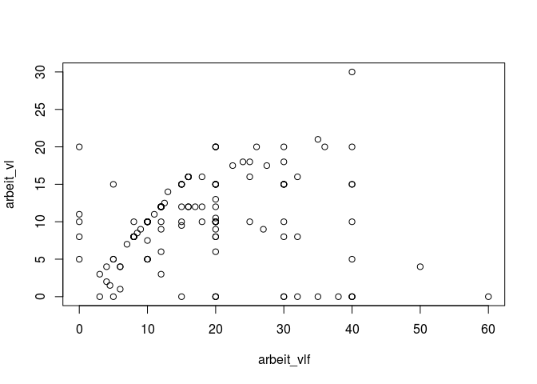
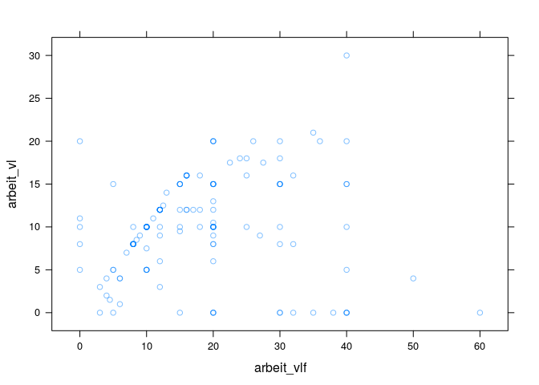
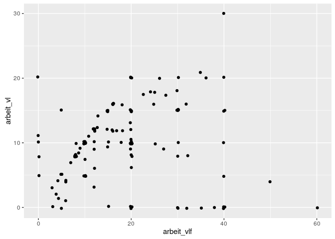
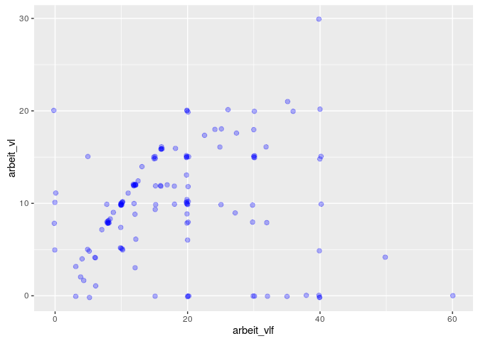

# Aufgabenblatt Zusammenhänge
Sarah Thiesen  
09.05.2016  

##Daten einlesen

```r
library(readstata13)
mydata <- read.dta13("/home/sarah/Dropbox/Uni/StatA_OwnData_V14.dta", nonint.factors = TRUE, generate.factors = TRUE)
var.labels <- data.frame(variable = names(mydata), description = attr(mydata,"var.labels"))
```

##Aufgabe 1

Neue Variable erstellen, die zwischen Vater Akademiker/Vater kein Akademiker unterscheidet

```r
library(dplyr)
mydata <- mutate(mydata, v_akademiker = as.numeric(v_beruf) %in% c(4, 5))
mydata$v_akademiker[is.na(mydata$v_beruf)] <- NA
mydata$v_akademiker[as.numeric(mydata$v_beruf) == 6] <- NA
```

Kontingenztabelle

```r
mytbl <- with(mydata, table(ausland, v_akademiker))
addmargins(mytbl)
```

```
##          v_akademiker
## ausland   FALSE TRUE Sum
##   0. Nein    28   42  70
##   1. Ja      49   57 106
##   Sum        77   99 176
```

Erstellen Sie eine Tabelle mit den dafür geeigneten relativen Häufigkeiten.

```r
myprop <- prop.table(mytbl, 2)
addmargins(myprop)
```

```
##          v_akademiker
## ausland       FALSE      TRUE       Sum
##   0. Nein 0.3636364 0.4242424 0.7878788
##   1. Ja   0.6363636 0.5757576 1.2121212
##   Sum     1.0000000 1.0000000 2.0000000
```

```r
addmargins(prop.table(mytbl, 1))
```

```
##          v_akademiker
## ausland       FALSE      TRUE       Sum
##   0. Nein 0.4000000 0.6000000 1.0000000
##   1. Ja   0.4622642 0.5377358 1.0000000
##   Sum     0.8622642 1.1377358 2.0000000
```

Bestimmen Sie eine Prozentsatzdifferenz im Hinblick auf die Absicht ins Ausland zu gehen.

```r
library(scales)
percent(myprop[2, 1] - myprop[2, 2])
```

```
## [1] "6.06%"
```

Wie würde die Indifferenztabelle bei statistischer Unabhängigkeit aussehen?

```r
mychisq <- chisq.test(mytbl)
mychisq$expected
```

```
##          v_akademiker
## ausland    FALSE   TRUE
##   0. Nein 30.625 39.375
##   1. Ja   46.375 59.625
```

Berechnen und interpretieren Sie $\chi^2$ und Cramér's V.

```r
mychisq
```

```
## 
## 	Pearson's Chi-squared test with Yates' continuity correction
## 
## data:  mytbl
## X-squared = 0.43524, df = 1, p-value = 0.5094
```

```r
cram <- as.numeric(sqrt(mychisq$statistic / sum(mytbl)))
paste("Cramér's V: ", round(cram, digits = 4))
```

```
## [1] "Cramér's V:  0.0497"
```

##Aufgabe 2

Neue Variable erstellen: Mathe-Abneigung kategorisiert

```r
statmath.kat <- as.numeric(mydata$statmath)
statmath.kat[as.numeric(statmath.kat) == 1] <- "niedrig"
statmath.kat[as.numeric(statmath.kat) == 2] <- "niedrig"
statmath.kat[as.numeric(statmath.kat) == 3] <- "mittel"
statmath.kat[as.numeric(statmath.kat) == 4] <- "mittel"
statmath.kat[as.numeric(statmath.kat) == 5] <- "mittel"
statmath.kat[as.numeric(statmath.kat) == 6] <- "hoch"
statmath.kat[as.numeric(statmath.kat) == 7] <- "hoch"
statmath.kat <- factor(statmath.kat, levels(as.factor(statmath.kat))[c(3:1)])
mydata <- cbind(mydata, statmath.kat)
```

Kontingenztabelle

```r
mytbl <- with(mydata, table(mathe_lk, statmath.kat))
mytbl
```

```
##          statmath.kat
## mathe_lk  niedrig mittel hoch
##   0. Nein      37     53   59
##   1. Ja        27     12   10
```

```r
prop.table(mytbl, 2)
```

```
##          statmath.kat
## mathe_lk    niedrig    mittel      hoch
##   0. Nein 0.5781250 0.8153846 0.8550725
##   1. Ja   0.4218750 0.1846154 0.1449275
```

$\chi^2$-Test

```r
mychisq <- chisq.test(mytbl)
mychisq
```

```
## 
## 	Pearson's Chi-squared test
## 
## data:  mytbl
## X-squared = 15.728, df = 2, p-value = 0.0003844
```

```r
cram <- as.numeric(sqrt(mychisq$statistic / sum(mytbl)))
paste("Cramér's V: ", round(cram, digits = 4))
```

```
## [1] "Cramér's V:  0.2818"
```

##Aufgabe 3

Korrelationskoeffizienten von statmath und statzahl berechnen

```r
cor(as.numeric(mydata$statmath), as.numeric(mydata$statzahl), use = "complete.obs")
```

```
## [1] 0.5523058
```

##Aufgabe 4

Zusammenhang zwischen Arbeitsstunden im Semester (arbeit vl) und Arbeitsstunden in den Semesterferien (arbeit_vlf)

###Streudiagramm mit plot()

```r
with(mydata, plot(arbeit_vlf, arbeit_vl))
```



###Streudiagramm mit lattice

```r
library(lattice)
xyplot(arbeit_vl ~ arbeit_vlf, data = mydata, alpha = 0.5)
```



###Streudiagramm mit ggplot2 - qplot()

```r
library(ggplot2)
qplot(arbeit_vlf, arbeit_vl, data = mydata, geom = "jitter")
```



###Streudiagramm mit ggplot2 - ggplot()

```r
m <- ggplot(mydata, aes(arbeit_vlf, arbeit_vl))
m + geom_jitter(colour = "blue", alpha = 0.3, size = 2)
```



Korrelationskoeffizient

```r
with(mydata, cor(arbeit_vlf, arbeit_vl, use = "complete.obs"))
```

```
## [1] 0.1256
```
