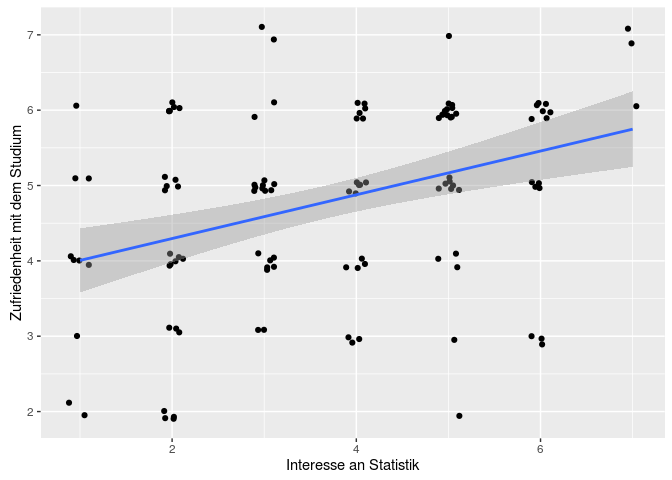
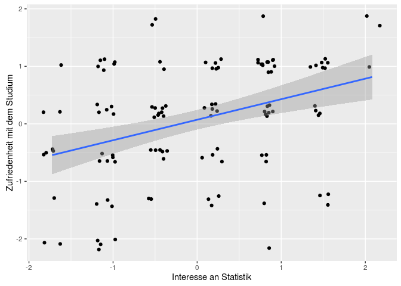
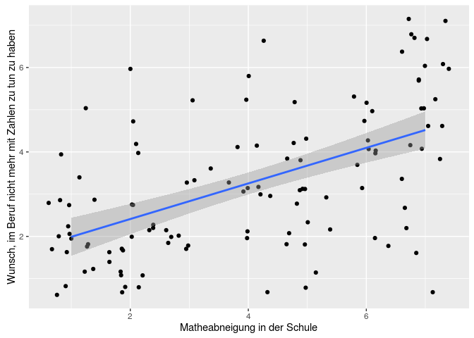

# Aufgabenblatt Regression
Sarah Thiesen  
06.06.2016  

##Daten einlesen

```r
library(readstata13)
mydata <- read.dta13("/home/sarah/Uni/StatA_OwnData_V14.dta", nonint.factors = TRUE, generate.factors = TRUE)
var.labels <- data.frame(variable = names(mydata), description = attr(mydata,"var.labels"))
```

##Aufgabe 1

Zusammenhang zwischen Interesse an Statistik (statint) und Studienzufriedenheit (zufried_stud).

a) Berechnen Sie die Korrelation zwischen beiden Variablen. Was können Sie über den Zusammenhang aussagen?


```r
cor(as.numeric(mydata$statint), as.numeric(mydata$zufried_stud), use = "complete.obs")
```

```
## [1] 0.3644861
```

Interesse an Statistik und Studienzufriedenheit sind positiv korreliert.

b) Sie nehmen an, dass das Statistikinteresse die Zufriedenheit mit dem Studium beeinflusst. Genauer gesagt, gehen Sie davon aus, dass Personen, die sich für Statistik interessieren, zufriedener mit dem Studium sind.
Stellen Sie zuerst eine allgemeine Regressionsgleichung auf und berechnen dann die Koeffizienten. Welche inhaltlichen Aussagen können Sie anhand der Koeffizienten treffen?
Wie groß ist der Anteil der im Modell durch statint erklärten Varianz?

x = statint  
y = zufried_stud


```r
library(dplyr)
library(ggplot2)

mydata <- mutate(mydata, num_zufried = as.numeric(zufried_stud), num_statint = as.numeric(statint))

r <- ggplot(na.omit(mydata), aes(x = num_statint, y = num_zufried))
r + geom_jitter(width = 0.3, height = 0.3) + stat_smooth(method = "lm") + ylab("Zufriedenheit mit dem Studium") + xlab("Interesse an Statistik")
```

<!-- -->

```r
regr <- lm(num_zufried ~ num_statint, mydata)
summary(regr)
```

```
## 
## Call:
## lm(formula = num_zufried ~ num_statint, data = mydata)
## 
## Residuals:
##     Min      1Q  Median      3Q     Max 
## -3.2037 -0.7203  0.2059  0.9107  3.0915 
## 
## Coefficients:
##             Estimate Std. Error t value Pr(>|t|)    
## (Intercept)  3.61324    0.21777   16.59  < 2e-16 ***
## num_statint  0.29522    0.05387    5.48  1.3e-07 ***
## ---
## Signif. codes:  0 '***' 0.001 '**' 0.01 '*' 0.05 '.' 0.1 ' ' 1
## 
## Residual standard error: 1.195 on 196 degrees of freedom
##   (2 observations deleted due to missingness)
## Multiple R-squared:  0.1329,	Adjusted R-squared:  0.1284 
## F-statistic: 30.03 on 1 and 196 DF,  p-value: 1.299e-07
```

13,29% der Varianz wird durch statint erklärt.

c) Was ändert sich, wenn Sie standardisierte Werte für die Berechnung heranziehen? Inwieweit verändern sich die inhaltlichen Aussagen, die Sie anhand der Regressionsgleichung nun treffen können?


```r
statint_mean <- mean(mydata$num_statint, na.rm = TRUE)
statint_sd <- sd(mydata$num_statint, na.rm = TRUE)
zufried_mean <- mean(mydata$num_zufried, na.rm = TRUE)
zufried_sd <- sd(mydata$num_zufried, na.rm = TRUE)

mydata <- mutate(mydata, z_statint = (num_statint - statint_mean)/statint_sd, z_zufried = (num_zufried - zufried_mean)/zufried_sd)

z <- ggplot(na.omit(mydata), aes(x = z_statint, y = z_zufried))
z + geom_jitter(width = 0.3, height = 0.3) + stat_smooth(method = "lm") + ylab("Zufriedenheit mit dem Studium") + xlab("Interesse an Statistik")
```

<!-- -->

```r
zregr <- lm(z_zufried ~ z_statint, mydata)
summary(regr)
```

```
## 
## Call:
## lm(formula = num_zufried ~ num_statint, data = mydata)
## 
## Residuals:
##     Min      1Q  Median      3Q     Max 
## -3.2037 -0.7203  0.2059  0.9107  3.0915 
## 
## Coefficients:
##             Estimate Std. Error t value Pr(>|t|)    
## (Intercept)  3.61324    0.21777   16.59  < 2e-16 ***
## num_statint  0.29522    0.05387    5.48  1.3e-07 ***
## ---
## Signif. codes:  0 '***' 0.001 '**' 0.01 '*' 0.05 '.' 0.1 ' ' 1
## 
## Residual standard error: 1.195 on 196 degrees of freedom
##   (2 observations deleted due to missingness)
## Multiple R-squared:  0.1329,	Adjusted R-squared:  0.1284 
## F-statistic: 30.03 on 1 and 196 DF,  p-value: 1.299e-07
```

##Aufgabe 4

Erinnern Sie sich an Übungsblatt 3, Aufgabe 3. Dort haben Sie den Zusammenhang zwischen der Matheabneigung in der Schule und dem Berufswunsch ohne Zahlen berechnet. Analysieren Sie nun diesen Zusammenhang mit Hilfe einer Regressionsanalyse. Gehen Sie dabei davon aus, dass die zeitlich zurückliegende Variable die zeitlich in der Zukunft liegende beeinflusst.

Wie lauten die Regressionskoeffizienten?
Wie groß ist der Berufswunsch ohne Zahlen für jemanden mit maximaler bzw. minimaler Matheabneigung?

x = statmath
y = statzahl


```r
m <- ggplot(na.omit(mydata), aes(x = as.numeric(statmath), y = as.numeric(statzahl)))
m + geom_jitter() + stat_smooth(method = "lm") + ylab("Wunsch, im Beruf nicht mehr mit Zahlen zu tun zu haben") + xlab("Matheabneigung in der Schule")
```

<!-- -->

```r
mathregr <- lm(as.numeric(statzahl) ~ as.numeric(statmath), mydata)
summary(regr)
```

```
## 
## Call:
## lm(formula = num_zufried ~ num_statint, data = mydata)
## 
## Residuals:
##     Min      1Q  Median      3Q     Max 
## -3.2037 -0.7203  0.2059  0.9107  3.0915 
## 
## Coefficients:
##             Estimate Std. Error t value Pr(>|t|)    
## (Intercept)  3.61324    0.21777   16.59  < 2e-16 ***
## num_statint  0.29522    0.05387    5.48  1.3e-07 ***
## ---
## Signif. codes:  0 '***' 0.001 '**' 0.01 '*' 0.05 '.' 0.1 ' ' 1
## 
## Residual standard error: 1.195 on 196 degrees of freedom
##   (2 observations deleted due to missingness)
## Multiple R-squared:  0.1329,	Adjusted R-squared:  0.1284 
## F-statistic: 30.03 on 1 and 196 DF,  p-value: 1.299e-07
```

Minimale Matheabneinung (1): 

```r
mathregr$coefficients[1] + mathregr$coefficients[2]
```

```
## (Intercept) 
##    2.104475
```

Maximale Matheabneinung (7): 

```r
mathregr$coefficients[1] + 7 * mathregr$coefficients[2]
```

```
## (Intercept) 
##    4.719434
```
