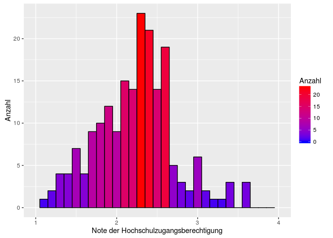

# Hypothesentests
Sarah Thiesen  
29.07.2016  

##Daten einlesen

```r
library(readstata13)
mydata <- read.dta13("/home/sarah/Uni/StatA_OwnData_V14.dta", nonint.factors = TRUE, generate.factors = TRUE)
var.labels <- data.frame(variable = names(mydata), description = attr(mydata,"var.labels"))

library(dplyr)
mydata <- mutate(mydata, weiblich = mydata$geschlecht=="1. weiblich", 
                 num_statint = as.numeric(statint), 
                 num_math = as.numeric(statmath),
                 lk = mydata$mathe_lk == "1. Ja",
                 num_zahl = as.numeric(statzahl))
```

##Histogramm Note der Hochschulzugangsberechtigung

```r
library(ggplot2)
h <- ggplot(mydata, aes(hzbnote))
h + geom_histogram(binwidth = 0.1, na.rm = TRUE, col = "black", aes(fill=..count..)) + scale_fill_gradient("Anzahl", low = "blue", high = "red") + labs(x = "Note der Hochschulzugangsberechtigung", y = "Anzahl") + xlim(c(1, 4))
```

<!-- -->
  
##Einseitiger Hypothesentest: Note der HZB

H<sub>0</sub>: Die durchschnittliche Note der Hochschulzugangsberechtigung liegt bei 2.0.  
H<sub>1</sub>: Die durchnittliche Note der Hochschulzugangsberechtigung ist höher als 2.0.


```r
t.test(mydata$hzbnote, mu = 2, alternative = "two.sided")
```

```
## 
## 	One Sample t-test
## 
## data:  mydata$hzbnote
## t = 5.4989, df = 199, p-value = 1.164e-07
## alternative hypothesis: true mean is not equal to 2
## 95 percent confidence interval:
##  2.130523 2.276477
## sample estimates:
## mean of x 
##    2.2035
```

-> Die H_0 kann verworfen werden.
  
  
##Zweiseitiger Hypothesentest: Note der HZB abhängig von Geschlecht

H<sub>0</sub>: Die durchschnittliche Note der Hochschulzugangsberechtigung von Männern und Frauen ist gleich.  
H<sub>1</sub>: Die durchschnittliche Note der Hochschulzugangsberechtigung von Männern und Frauen ist unterschiedlich.

F-Test:

```r
var.test(mydata$hzbnote ~ mydata$geschlecht)
```

```
## 
## 	F test to compare two variances
## 
## data:  mydata$hzbnote by mydata$geschlecht
## F = 1.3161, num df = 85, denom df = 111, p-value = 0.1741
## alternative hypothesis: true ratio of variances is not equal to 1
## 95 percent confidence interval:
##  0.8852858 1.9777761
## sample estimates:
## ratio of variances 
##           1.316062
```
-> Varianzheterogenität kann nicht ausgeschlossen werden


```r
t.test(mydata$hzbnote ~ mydata$geschlecht, alternative = "two.sided", var.equal = FALSE)
```

```
## 
## 	Welch Two Sample t-test
## 
## data:  mydata$hzbnote by mydata$geschlecht
## t = 0.98178, df = 169.05, p-value = 0.3276
## alternative hypothesis: true difference in means is not equal to 0
## 95 percent confidence interval:
##  -0.07616098  0.22686695
## sample estimates:
## mean in group 0. maennlich  mean in group 1. weiblich 
##                   2.247674                   2.172321
```

-> Die H_0 kann nicht abgelehnt werden
